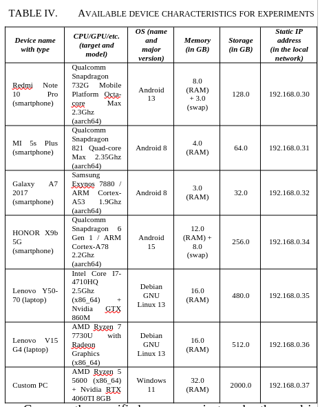

# misc

## Glossary
1. [Defense in depth](https://en.wikipedia.org/w/index.php?title=Defense_in_depth_(computing)&oldid=1314620556)
1. [Small language model](https://en.wikipedia.org/w/index.php?title=Small_language_model&oldid=1345576174)
1. [End-to-end encryption](https://en.wikipedia.org/w/index.php?title=End-to-end_encryption&oldid=1339000049)
1. [System on a chip](https://en.wikipedia.org/w/index.php?title=System_on_a_chip&oldid=1344848938)
1. [Peer-to-peer](https://en.wikipedia.org/w/index.php?title=Peer-to-peer&oldid=1346743855)
1. [Heterogeneous computing](https://en.wikipedia.org/w/index.php?title=Heterogeneous_computing&oldid=1340019863)
1. [Computer hardware](https://en.wikipedia.org/w/index.php?title=Computer_hardware&oldid=1345859959)
1. [Cryptocurrency tumbler](https://en.wikipedia.org/w/index.php?title=Cryptocurrency_tumbler&oldid=1332259446)
1. [Inference engine](https://en.wikipedia.org/w/index.php?title=Inference_engine&oldid=1347612116)
1. [Digital data](https://en.wikipedia.org/w/index.php?title=Digital_data&oldid=1347342104)
1. [Trusted Computing](https://en.wikipedia.org/w/index.php?title=Trusted_Computing&oldid=1308113095)
1. [InterPlanetary File System](https://en.wikipedia.org/w/index.php?title=InterPlanetary_File_System&oldid=1337299955)
1. [Proof of work](https://en.wikipedia.org/w/index.php?title=Proof_of_work&oldid=1345155443)
1. [Decentralized physical infrastructure network](https://en.wikipedia.org/w/index.php?title=Decentralized_physical_infrastructure_network&oldid=1332623570)
1. [Consensus](https://en.wikipedia.org/w/index.php?title=Consensus_(computer_science)&oldid=1341381533)
1. [Overlay network](https://en.wikipedia.org/w/index.php?title=Overlay_network&oldid=1347592398)
1. [Moore's law](https://en.wikipedia.org/w/index.php?title=Moore%27s_law&oldid=1346163905)
1. [Optical transistor](https://en.wikipedia.org/w/index.php?title=Optical_transistor&oldid=1345542360)
1. [Optical computing](https://en.wikipedia.org/w/index.php?title=Optical_computing&oldid=1342566363)
1. [Optical storage](https://en.wikipedia.org/w/index.php?title=Optical_storage&oldid=1333542787)
1. [Field-programmable gate array](https://en.wikipedia.org/w/index.php?title=Field-programmable_gate_array&oldid=1346369861)
1. [Application-specific integrated circuit](https://en.wikipedia.org/w/index.php?title=Application-specific_integrated_circuit&oldid=1345774971)
1. [Neural processing unit](https://en.wikipedia.org/w/index.php?title=Neural_processing_unit&oldid=1346876583)
1. [Tensor Processing Unit](https://en.wikipedia.org/w/index.php?title=Tensor_Processing_Unit&oldid=1348015185)
1. [Von Neumann architecture](https://en.wikipedia.org/w/index.php?title=Von_Neumann_architecture&oldid=1332273422)
1. [Open-source hardware](https://en.wikipedia.org/w/index.php?title=Open-source_hardware&oldid=1348116153)
1. [Radiation hardening](https://en.wikipedia.org/w/index.php?title=Radiation_hardening&oldid=1337346383)
1. [Retrieval-augmented generation](https://en.wikipedia.org/w/index.php?title=Retrieval-augmented_generation&oldid=1347150608)
1. [Daemon](https://en.wikipedia.org/w/index.php?title=Daemon_(computing)&oldid=1336577528)
1. [Separation of concerns](https://en.wikipedia.org/w/index.php?title=Separation_of_concerns&oldid=1334377382)
1. [2024–present global memory supply shortage](https://en.wikipedia.org/w/index.php?title=2024%E2%80%93present_global_memory_supply_shortage&oldid=1349145248)
1. [List of countries by electricity production](https://en.wikipedia.org/w/index.php?title=List_of_countries_by_electricity_production&oldid=1349234436)
1. [Hardware backdoor](https://en.wikipedia.org/w/index.php?title=Hardware_backdoor&oldid=1342190469)
1. [History of the Internet](https://en.wikipedia.org/w/index.php?title=History_of_the_Internet&oldid=1349353832)
1. [Content delivery network](https://en.wikipedia.org/w/index.php?title=Content_delivery_network&oldid=1347161630)
1. [Domain Name System](https://en.wikipedia.org/w/index.php?title=Domain_Name_System&oldid=1347240445)
1. [Just-in-time compilation](https://en.wikipedia.org/w/index.php?title=Just-in-time_compilation&oldid=1346827793)
1. [Distributed artificial intelligence](https://en.wikipedia.org/w/index.php?title=Distributed_artificial_intelligence&oldid=1344693066)
1. [Network topology](https://en.wikipedia.org/w/index.php?title=Network_topology&oldid=1337719431)
1. [Federated learning](https://en.wikipedia.org/w/index.php?title=Federated_learning&oldid=1350755272)
1. [Internet geolocation](https://en.wikipedia.org/w/index.php?title=Internet_geolocation&oldid=1339927887)
1. [Software-defined networking](https://en.wikipedia.org/w/index.php?title=Software-defined_networking&oldid=1347919566)
1. [Secure multi-party computation](https://en.wikipedia.org/w/index.php?title=Secure_multi-party_computation&oldid=1350728813)
1. [Homomorphic encryption](https://en.wikipedia.org/w/index.php?title=Homomorphic_encryption&oldid=1349053972)
1. [High availability](https://en.wikipedia.org/w/index.php?title=High_availability&oldid=1307901527)
1. [Booting process of Android devices](https://en.wikipedia.org/w/index.php?title=Booting_process_of_Android_devices&oldid=1344729913)
1. [Kademlia DHT](https://en.wikipedia.org/w/index.php?title=Kademlia&oldid=1341409930)
1. [Distributed hash table](https://en.wikipedia.org/w/index.php?title=Distributed_hash_table&oldid=1336413667)
1. [Remote procedure call](https://en.wikipedia.org/w/index.php?title=Remote_procedure_call&oldid=1350860771)
1. [Universal basic income](https://en.wikipedia.org/w/index.php?title=Universal_basic_income&oldid=1351437740)

## Alternative models of hardware and optimizations 
McMahon [1] - Optical hardware offers advantages over electronic one via massive bandwidth and speed of light capabilities similarly to fiber-optic technologies. These systems can reduce thermal/heat output due to low resistance and the charge-neutrality of photons. Furthermore, co-packaged optics can act as a transitional layer between photons and electrons to bypass the overhead of packet-based networking.

Zhao et al. [2] - Future perspectives of integrating quantum computing for optimized matrix and other operations in AI. Also, it gives understanding that engineers have to explore alternative forms of computations (e.g., non-Von Neumann architectures, analog computing instead of digital one due to lower power consumption, etc.).

Silicon chips have weaknesses under cosmic rays and radiation that lead to unpredictable or non-deterministic behavior, while diamonds and their synthetic variations are used in radiation-hardened electronics [3].

Jelinčič et al. [4] - Designing specialized hardware for diffision-like models.

Taalas [5] - They propose a solution for mapping generative models directly onto ASIC (Application-Specific Integrated Circuit) hardware for inference. This approach increases tokens per second and reduces manufacturing costs by eliminating the need for expensive general-purpose hardware (e.g., GPU). However, this method prevents on-the-fly model updates because it requires producing a new separate chip.

Hardware efficiency can be improved by optimizing power states through checkpoints, transferring produced heat for other utilities, and undervolting to lower passive idle costs [6].

Reducing carbon emissions by benchmarking Python and other PL (programming languages) to find more efficient one.

References:
1. https://doi.org/10.1038/s42254-023-00645-5
1. https://doi.org/10.48550/arXiv.2604.07639
1. https://techport.nasa.gov/projects/154516
1. https://doi.org/10.48550/arXiv.2510.23972
1. https://taalas.com/the-path-to-ubiquitous-ai/
1. https://doi.org/10.48550/arXiv.2409.02214
1. https://pythonspeed.com/articles/co2-emissions-software/

## Open models for transparency and reproducibility
Companies like OpenAI and Anthropic lack transparency regarding their methodologies and datasets. Generally, they utilize several data sources for training: internal data from their own platforms and clients, data provided by vendors and enterprise partners, and web-crawled data. The last category is particularly difficult to index or remove, as many American companies do not adhere to GDPR (The General Data Protection Regulation) or European data protection practices. Also, there are common methods to prevent threats of rogue or poisoned models [1]: using verified open weights models for reproducibility or contributions, cryptographic verification (hashing and keys), software bills of materials, and rigorous testing.

References:
1. https://opensource.org/ai/open-source-ai-definition

## Small and optimized AI models
- Lossless compression of model weights for “data at rest” and decompression for "data in use".
- Using integer-based models instead of floats and 1-bit models like BitNet [1] and Bonsai [2].
- Quantization for pre-trained models [3].
- Fine-tuning with Low-Rank Adaptation (LoRA) to reduce redundant parameters [4].
- TurboQuant as vector quantization algorithm [5].
- Diffusion language models to generate large chunks or blocks of output and refining it, instead of generating token-by-token output [6].

References:
1. https://doi.org/10.48550/arXiv.2402.17764
1. https://github.com/PrismML-Eng/Bonsai-demo
1. https://doi.org/10.48550/arXiv.2210.17323
1. https://doi.org/10.48550/arXiv.2106.09685
1. https://doi.org/10.48550/arXiv.2504.19874
1. https://doi.org/10.48550/arXiv.2508.10875

## Optimizing input/output context
The input/output context window of language models is limited and requires increasing amounts of computation. Therefore, experts suggest possible techniques to address these issues:
- Directly producing native binary (machine code, assembly, raw bytes) and byte-code instead of tokens in source code [1], [2], [3]. Transformer-based generative models can be designed and trained on specific CPU instructions, opcodes, and assembly to create a natural binary interface or apply optimizations with assistance from verification software.  However, this approach is not reliable: single-bit hallucinations can cause crashes, debugging is difficult, writing source code which further produced to binary is more practical due to availability of existing training datasets and deterministic compilers. However, these models are applicable for reverse engineering and deobfuscation tasks, specifically during the generation of intermediate representation (IR) in Ghidra.
- RAG (retrieval-augmented generation) and knowledge graph to search relevant information by indexed chunks or components of graph (vertices and edges).
- Allowing language model mixing multiple PL depending on specifics of tasks.
- Concise specialized PL (e.g., APL, SQL, etc.) and short identifiers like in C standard library instead of being too expressive and human-readable.
- Using Mandarin Chinese instead of English [4], context minimizers with constraint expressiveness [5], and combining multiple languages with low entropy in reasoning blocks can reduce token consumption during model inference. 
- Prompting in structured data formats like YAML and JSON without whitespaces instead of plaintext [6, p. 9]
- Allowing language model to directly call CLI (command line interface) and shell commands instead of forming JSON requests to MCP (model context protocol) server. Also, Paramanayakam et al. demonstrate that selectively scoping available API tools for function calling improves agentic task-completion accuracy and reducing execution time [7].

References:
1. https://doi.org/10.48550/arXiv.2410.20771
1. https://doi.org/10.48550/arXiv.2402.19155
1. https://doi.org/10.48550/arXiv.2412.09871
1. https://doi.org/10.1038/s41586-025-09422-z
1. https://github.com/JuliusBrussee/caveman
1. https://doi.org/10.48550/arXiv.2401.08500
1. https://doi.org/10.48550/arXiv.2411.15399

## @TRANSLATE(FROM_RUSSIAN_TO_ENGLISH): Future works
### Local distributed inference of models on low-end devices
Реализация распределенного инференса на доступных devices из различных категорий (smartphones/mobile and tablets, laptops, microcontrollers, and PCs) on figure below внутри a local area network (LAN). Для этого я ранее уже пытался установить на каждом из устройств [llama-cpp для distributed inference over RPC](https://github.com/ggml-org/llama.cpp/blob/master/tools/rpc/README.md). Решил не использовать [vllm с их distributed serving](https://docs.vllm.ai/en/v0.8.0/serving/distributed_serving.html), ведь в нем experimental поддержка GGUF и требуются доп. зависимости, но в будущем стоит сравнить множество компонентов между собой и сделать бенчмарки:
- 
- Inference engines (и специфические like llm-d, litert-lm, tensortr, sglang, huggingface-transformers, etc.)
- Backend (cuda, vulkan, rocm, webgpu, etc)
- Разными latest моделями: Gemma 4 (E2B and E4B edge models), Qwen 3.5 (GGUF like 4B on Q4_K_M and other variants), etc.
- Форматами (GGUF, ONNX, safetensors, etc.)
- Параметрами и конфигурациями
- Categories of задачами и экспериментами - automation, backend hosting, data processing, tool calls, and other computations. К примеру, возьмем SOTA model like Gemini 3.1 для prompt expansion/generation from metaprompt to Gemma model (e.g., задача анализа ПО на потенциальные уязвимости на определенных snippets of code или полноценные repositories). Или using tools или domain задач in hearthstone_mcp_as_bots_acting_in_games for simulated game and action of environment (or text based role-play games or even minecraft but simplified to state of terraria). Возможно понадобится fine-tuning модели специально под hearthstone, чтобы она лучше понимала как принимать решения касательно данной игры и знания (об текущией мете, функционале, особенностях игры или режимов, определенных карт, и т.д.). Или для задач reverse engineering применяя Ghidra with MCP and skills like https://github.com/OwenPawl/ghidra-re-skill/tree/main.
- Prompting stategies - e.g., using neurosymbolic AI and harness layers (claude code, openclaw, opencode, or self-made solutions) like explained in https://martinfowler.com/articles/harness-engineering.html.
- И многое другое

### Benchmarking process of inference
Также другие аспекты касательно benchmarking, A/B testing, сбора данных, и статистики по инференсу как из https://youtu.be/lLG-xN25v20 on different setups/conditions:
- Такая распределенная система необязательно потенциально увеличивает overall performance due to networking overhead and data transmission delays, но applicable for processing a large amount of data by utilizing the combined memory and storage of multiple devices. Also, how to increase performance from networking stack (like async sockets)?
- Показатели по типу token per second time speed, time to load model in memory, time for first token power consumption rate in watts on inference, pricing per million of token price for cloud models c точки зрения как такая токеномика может быть self-sustainable или ведет к убыткам based on openrouter pricings, и попутные затраты (выделение тепла, наличие охлаждения в жидком или газообразной форме, износ hardware и оборудования, обслуживание оборудование с оплатой персоналу, и т.д.).
- Как лично для себя можно это оптимизировать (к примеру, статегия по использованию электричества из общественных мест по типу университета и кофейн вместо затрат дома)?
- И другое: models with their parameters/metadata/sizes, context size, prompts with responses, video recordings, RAM/VRAM/CPU/GPU and other hardware descriptions, optimizing configuration with llama-bench, температура, нагрузка cpu/gpu, указать даты когда все было собраны и курс доллара к тенге по возможности

### Configuring available Android devices
The primary "master" machine used to configure other devices (especially smartphones) ran Debian 13 GNU/Linux (latest) on an x86_64 architecture with CPython 3.13.5 and GNU Bash 5.2.37. Android Studio Panda 3 2025.3.3 Patch 1 [1] was installed on it for the ADB over Wi-Fi / wireless bridge [2] (used for debugging, uploading, and running scripts), which also requires to download SDK Manager package. Also, it is possible to download ADB seperately within SDK Platform Tools [3]. Optionally, Android devices running 11.0+ support ADB without need for initial USB connection to the device. The wireless and USB debugging features was enabled in the Developer Options on clean Android devices. 
```sh
# setup adb server
adb kill-server
adb start-server

# connecting to them on specified port
adb tcpip <adb_port>
adb connect <device_ip>:<adb_port>

# checking if devices are visible
# and available with their transport_id
adb devices -l

# connect to shell
adb -t <transport_id> shell
```
After all of that, Termux v0.118.3 [4] was installed via ADB on each available Android device without rooting them. However, Termux officially maintained only minimal compatibility with Android 5.0+ versions [5].
```sh
# ref: https://github.com/termux/termux-app/issues/3653 + temporary disable Google Play Protect
adb -t <transport_id> install --bypass-low-target-sdk-block termux_<version>.apk

# temporary disable limits on phantom/child processes
# needed for background tasks and proot-distro
adb -t <trasnport_id> shell "settings put global settings_enable_monitor_phantom_procs false"
termux-wake-lock

# connect to shell of device and termux
adb -t <transport_id> shell -t "run-as com.termux /data/data/com.termux/files/usr/bin/login"
cd /files/home

# specify environment variables
# ref: https://github.com/termux/termux-packages/issues/25249
# найти способ чтобы закрепить данную информацию в сессии?
export PATH=/data/data/com.termux/files/usr/bin:$PATH

# configure termux package from main or cloudflare cdn without mirrors
# ref: https://github.com/termux/termux-packages/wiki/Mirrors
termux-change-repo
termux-upgrade-repo

# update available packages
apt update && apt upgrade -y

# allow access to device storage
termux-setup-storage

# setup proot-distro,
pkg install proot proot-distro
proot-distro install debian # @TODO: causes "Exiting due to failure" if doing within adb, but finishes successfully when manually entering
proot-distro login debian --isolated
```

Также ниже представлена базовая информация по поводу сборке llama.cpp:
- install additional packages like build-essential, make, wget, curl, clang, cmake, git, libandroid-spawn according to https://github.com/ggml-org/llama.cpp/blob/master/docs/build.md#cpu-build and https://github.com/ggml-org/llama.cpp/blob/master/docs/android.md#build-cli-on-android-using-termux
- clone only one layer of llama-cpp repo by defining depth==1
- pkg install libandroid-spawn due to https://github.com/ggml-org/llama.cpp/issues/18615, https://github.com/termux/termux-packages/issues/4634, https://github.com/ggml-org/llama.cpp/issues/19388, and https://github.com/termux/termux-packages/tree/master/packages/libandroid-spawn
- cmake -B build; cmake --build build --config Release -j$(nproc);
- download models from hugginface like https://huggingface.co/unsloth/Qwen3.5-4B-GGUF
- run models via produced binaries in /llama.cpp/build/bin/

Пока столкнулся с несколькими проблемами во время конфигурации окружения Termux, сборки llama-cpp на устройствах, и другими вещами для экспериментов:
- Установка "proot-distro install debian" через adb shell вызывает unknown error, что скорее всего связано с выставленными лимитами на child processes.
- Compilation bug на одном из samsung smartphone в котором вышла ошибка при 60-62 процентах об "ld.ldd: error: undefined symbol: posix_spawn, referenced by subprocess.h", хотя на нем установил libandroid-spawn. Возможно нужно установить какие-то еще пакеты по типу llmv, termux-exec, and other dependencies (but need to document them all for reproducibility).
- Приложения с systemd не работают на чистом Termux, ведь systemd процесс попросту не работает внутри такого окружения и даже в proot-distro. Однако, некоторые приводят доводы, что systemd может функционировать под Termux внутри qemu виртуалок либо lxc контейнеров. Но где-то писали что для этого нужно еще rooting phone чтобы поставить custom kernel with cgroup support. Помимо этого есть termux-services и init системы, но они все равно имею ограниченный support. 
- Systemd нам изначально нужен был для установки "Merly Mentor", для которого еще нужны другие зависимости (git, sudo, nodejs, file, xz, и другое что требуется для their install.sh and MerlyInstaller). Merly Mentor в целом focuses on analyzing various open-source software using complex analysis systems. Мы изначально хотели модифицировать его to specify a custom inference server or endpoint, но там используется загрузка определенного списка моделей from .models директории. Также, мы хотели помочь Mentor Planet Project за счет distributed hosting of produced analysis results, resources, and open-source repositories in IPFS Kubo implemetation of distributed storage + hosting their web services.
- Каким образом можно вообще запустить prometheus_node внутри Termux, чтобы передавалась реальная актуальная информация с устройства по различным показателям (нагрузка, батарея, процессы, memory, storage, и т.д.) или нужно искать другое ПО для этого (но не просто CLI like top, lscpi, free -h, etc.)? Пока нашел только обсуждение в https://github.com/prometheus/node_exporter/issues/2611, но там недостаточно информации.
- Также сбор по network traffic monitoring via wireshark/tcpdump/pcapdroid to analyze how llama-cpp transfers data like in https://github.com/kdbugk/game-of-kingshot-re (and mention that requires SSL/TLS and token-authentication + only used on private/local networks instead of public ones), "ip addr" чтобы проверить IP в локальной сети, и ping чтобы удостоверится что соединение между устройствами функционирует.
- Также я изначально билдил llama-cpp только под CPU backend, но забыл что у большинства smartphones chips сформированы по SoC (System on a chip), где одновременно есть GPU/CPU/RAM. Поэтому стоит посмотреть /proc/cpu, lscpu, adb shell dumpsys, vulkaninfo (предварительно установив clinfo vulkan-tools), чтобы узнать можно ли сбилдить llama-cpp под [vulkan для android](https://developer.android.com/games/develop/vulkan/overview) for more efficient computations.
- Find way for controlling android devices via python https://dustingram.com/articles/2010/06/18/automated-control-of-an-android-device-with-python/, https://www.hackthebox.com/blog/intro-to-mobile-pentesting, https://www.reddit.com/r/termux/comments/18jcg1b/create_an_android_game_bot_using_termux_gui_api/
- Какие GGUF модели подбирать с помощью статистического анализа и других показателей заранее, чтобы не перебирать их вручную и не загружать излишнии. А также желательно не использовать quantization from unsloth и других компаний, а официальные поставки только или самому делать quantizations из-за poisoned models.
- И другие сложности по Termux:
    - How to turn off background processes - to have only termux turned on?
    - How to optimize mobile (disabling telemetry) and delete unnecessary software provided by vendor like samsung?
    - How to monitor power consumption rate on mobile devices to calculate costs?
    - Using swap file from storage as memory in android?
    - Check termux description in GitHub, because they say that F-droid variation is provided by third-party.
    - How to build termux for devices with less than android 5.0?

Additional references, and resources:
1. https://developer.android.com/studio and https://android.googlesource.com/platform/tools/base/+/studio-master-dev/studio.md
1. https://developer.android.com/tools/adb
1. https://github.com/termux/termux-app/wiki/Termux-on-android-5-or-6
1. https://developer.android.com/tools/releases/platform-tools
1. https://github.com/termux/termux-app and https://f-droid.org/en/packages/com.termux/

### Further concepts and ideas
Спарсить более детальную информацию про другие Android supported devices, другими ОС, и категориями устройств:
- Потенциальные официальные ссылки https://www.chromium.org/chromium-os/chrome-os-systems-supporting-android-apps/, https://storage.googleapis.com/play_public/supported_devices.html, https://support.google.com/googleplay/answer/1727131?sjid=6983645494448400442-EU, https://support.google.com/googleplay/android-developer/answer/9859371?hl=en&visit_id=639120121069493651-2570255299&rd=1, https://source.android.com/docs/compatibility, https://storage.googleapis.com/play_public/supported_devices.html, https://en.wikipedia.org/wiki/List_of_custom_Android_distributions
- Market share stats based on manifactured amounts and bought ones from customers
- Active usage показатели как в steam hardware survey
- Статистика по уязвимостям android и ПО на нем с корреляцией распространения на версии
- Статистика по кол-ву смартфонов в мире и его рынку сбыта, максимальный/минимальный/средний/гарантий срок службы/работы устройства, рынок вторичных деталей, и другие доп. данные в анализ необходимы

Сбилдить Generic Kernel Image (GKI) in Android по гайду из https://source.android.com/docs/core/architecture/kernel/generic-kernel-image for:
- Есть категория устройств которые are incompatible with certain linux kernel
- Alternative kernels for multiple devices at once
- Patching kernel by yourself for specific hardware like https://github.com/ravindu644/Android-Kernel-Tutorials
- Extended support in Android like LTS versions and backports
- Using custom ROMs

Упомянуть детали и структуру данных для hardcoded задач (к примеру, для задач аннотации данных будет передаваться input: {task_id: uuid, tag:"video" | "audio" | "image", type: "segmentation" | "classification" | ..., resource_link:"", ...}, output: {task_id: uuid, annotations: bbox | list[bbox] | ... (depends on type field)}).

Первые концепции для кастомных игровых режимов как game aggregator в первом слое:
- maze game, minesweeper, blockly games, chess, casino, alias game, trivia game like quiplash, infinite craft, monopoly one, meme-police games
- пазл или головоломка где с помощью логических блоков проходишь по лабиринту от пункта А к пункту Б с различными ограничениями на кол-ва логических блоков, попыток, и т.д.
- rpg remastered with: ai generated images (dynamic ai generated images like multiple variations of transparent trees), рандомная генерации карты, infinity replayability and progression capacity / вариативность, AI synthetic data generation and faker-based deterministic generator.
- переосмысление minevision and openvision via smartphones (дополненная реальность like pokemon go) с интеграцией с видеокамерами и другими устройствами / видами управления и assistance системами для disabled people различных видов.
- open-world возможности, player mechanics based on game core, тoкen сессии игры как jwt чтоб было понятно когда игра началась и когда должна завершится
- open world game (вдохновения: mmo rpg, lego universe (darkflames universe), пиратские сервера, gta engines (ragerp, samp, mta, fivem), gmod, terrafirmacraft)
- modding functionality in games (custom maps, режимы, и другое like in source engine sdk)

Using C++, Golang, Rust, or C without too much dependencies with compilation to WASM target instead of native ones:
- может такие кастомные режимы будут загружатся как просто бинарники, но тогда это будут небезопасно для исполнения?
- базовый игровой движок с упором на логику и на кастомизацию чем на графику
- scripting language in form of DSL or visual like scratch

Potential problems, solutions, и разное not sorted:
- Optimizations for inference: multilayer attention, paged attention, flash attention, speculative decoding, matrix multiplications, distributed kv cache, increasing hardware utilization fore models, cpu sparsification, prefill phase for optimization of inference (https://developer.nvidia.com/blog/mastering-llm-techniques-inference-optimization/ and https://huggingface.co/blog/tngtech/llm-performance-prefill-decode-concurrent-requests)
- sanity connection check for rpc communications and packets https://docs.vllm.ai/en/stable/usage/security/#security-and-firewalls-protecting-exposed-vllm-systems
- Интеграция subscription-based модели с ценой за вхождение в раннем доступе.
- Изучить детально source code и принципы работы nodes of Bitcoin and Ethereum. Golang мультиплатформенности. Open source by BSD license from the start with GPL due to its permissiveness. But not using MIT, because need mentioning of original project.
- Необходим патент или лицензирование (международный и казахстанский), чтобы позже дать запрос компаниям которые занимаются обработкой данных или AI моделями на пробный период участия в проекте для выдачи финансирования и партнерства. Также, подумать об безвозмездных грантах и пожертвования.
- Simulation and visualization of distributed computing (e.g, blockchain analytics tools like chainanalysis, TRM, elliptic, etc.).
- Для криптографии необходимы безопасные, future proof, и постквантовые алгоритмы. Аспекты of post-quantum cryptography, децентрализованной авторизации, data encryption для защиты сети, distributed computing and decentralized computing.
- Сложности регулярной поддержки and maintenance с обновлениями. Каким образом они будут скачивать и откуда последнии версии ПО и так чтоб обновлялись иначе будет drift?
- Ограничения загрузки крупных файлов и DoS/DDoS атаки. К примеру, turing complete blockchain like etherium имеет gas rate for execution of smartcontracts, чтобы не было контрактов с бесконечным while loop нагружающие сеть без динамических costs. Но в случае bitcoin он turing incomplete, там есть ограничение на OP_RETURN размера блока по хранению данных.
- Modding and plugins (modding api, scripting): teardown, source engine, minecraft mods, MTA, blender addons, chromium plugin architecture (https://www.chromium.org/developers/design-documents/plugin-architecture/), platforms for mod hosting (curseforge, nexus mods, etc.), https://cs.uwaterloo.ca/~m2nagapp/courses/CS446/1195/Arch_Design_Activity/PlugIn.pdf, pytest plugins
- AI system in games (ai bots, agents): MineDojo AI, https://en.wikipedia.org/wiki/Internet_bot, https://www.youtube.com/watch?v=6cK_LQkDFgY
https://youtu.be/aVTYxHL45SA
- использование как сервис для закладок и нелегальной активности
- поддержка своего voxel движка / игры / платформы с нуля это проблематично и сложно, поэтому проще работать на базе Minecraft как модификация (java, scala, python intertop with java (jvm bridges, jython, etc.))? Практика с modding API (fabric, forge, и другие) для реализации в будущем других идей и gamedev наработок.
- попробовать модельки упрощенно задизайнить через https://www.blockbench.net/. voxel based game?
- постепенно мигрировать элементы игры в систему симуляций
- Защита персональных данных (аномизация в Google системах и Monero), имутабильности, и децентрализации. Возможно некоторые блоки в блокчейне должны содержать вместо транзакций как раз хэши этой информации (хэш будет браться от base64 енкодинга данных ведь могут быть разные медиа форматы, но тогда “транзакций” в блоках будет слишком много и блоки по размера тоже?). 
- Graph tree of races to progress with multiple ways (ai generated list of dynamic races with multiple ways to progress depending on specific thing you do or progress in which)
- Jailbreak для модели чтобы не быть ограниченным alignment ограничениями.
- MCP сервер и промпты для действий агента с расписанными состояниями по выполнению задач в форме FSM (finite state machine).
- Возможно ли создать такой консенсус алгоритм где нельзя иметь больше определенного кол-ва nodes? То есть, они будут строго привязаны за определенным человеком (like Proof of identity or authority) и то что его можно будет только запускать с определенного устройства (и любые попытки его изменения или модификации будут сразу отказываться всей сетью). Ведь decentralization principles lead to risks of not adhering common rules with no real restrictions and guardrails mechanisms to prevent possible breakage contracts. facilitate обязательный order instead of chaos (e.g., using only specific computing devices for nodes, specifically signed software after attestation, limiting power распределение чтобы нельзя никаким образом процент сети - или вовсе смотреть на сеть не на процентное распределение силы а на другие меры и показатели consensus).
- Каким образом можно design AI-specific chips (software and hardware) и выстроить отечественное производство of ASIC/FPGA within Kazakhstan like Intel and Apple did in USA https://youtu.be/ktFlaBhpMu8:
    - is it possible to start startup for hardware manufacturing without external suppliers
    - orienting on cutting edge and alternative computting (photons instead of electrons, synthetic diamonds instead of silicon, quantum computing)
    - need base in electonics and hardware engineering, quantum physics, and math
    - aspects of ASICs: ASIC resistance in PoW, attack on FPGA and using FPGA computations, https://news.ycombinator.com/item?id=35240230, https://en.wikipedia.org/wiki/Environmental_impact_of_bitcoin
- Cделать cryptojacking наподобие Anubis protection для вебсайтов (проще говоря, с пользователя требуется замайнить или потратить определенное кол-во вычислительной мощи чтобы его пропустило на веб сайт) [reference: https://lock.cmpxchg8b.com/anubis.html]. Или другие вектора чтобы увеличить нечестным образом у себя computation power как bad actor:
    - fake cloudflare verification on website as phishing for malware
    - in january 2026, archive.today added code into its website to perform distributed denial of service attack againts a blog
    - supply chain attacks
